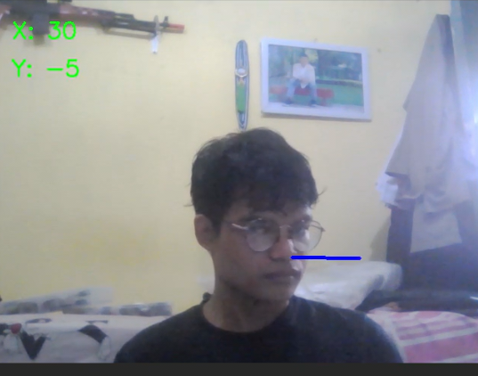
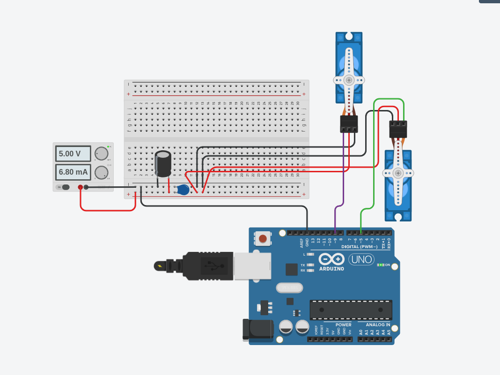

# Arduino Face Tracker

A Python script that tracks head movements and controls Arduino servos via serial communication.



### Key Features
* **AI-Driven Hardware**: Uses Python (OpenCV and MediaPipe) to detect head pose and drive Arduino servos instantly.
* **Low Latency**: Uses 115200 baud rate for fast response.
* **Stable**: Implements a "dead zone" logic to avoid servo jitter.
* **Lightweight**: Sends simple integer data instead of heavy strings/floats.

### Wiring
Simple 2-axis **Pan/Tilt** servo setup:
* **Pin 9**: Pan (X-Axis)
* **Pin 6**: Tilt (Y-Axis)



### Setup & Usage

**1. Hardware Setup**
Connect the servos to the Arduino pins as shown in the wiring diagram.

**2. Arduino Firmware**
Upload the `arduino_code.ino` file to your board using Arduino IDE.

**3. Software Dependencies**
Install the required libraries (optimized for Python 3.10):
```bash
pip install -r requirements.txt
```
**4. Run**

* Edit the serial port in `main.py` if necessary (e.g., `/dev/ttyUSB0` or `COM3`).
* Run the script:

```bash
python main.py

```

### Requirements

* Python 3.8 - 3.10 (Recommended)
* OpenCV, MediaPipe, PySerial, NumPy (versions specified in `requirements.txt`)
